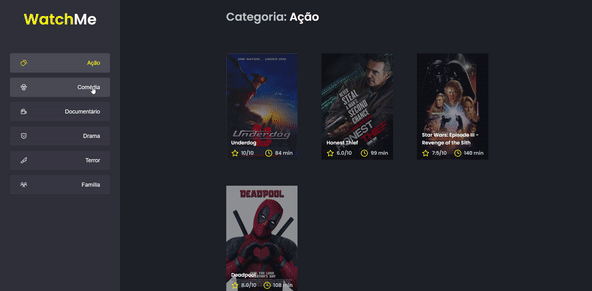

  

## Sobre 📖
Desafio opcional feito pela Rocketseat onde temos uma aplicação chamada WatchMe onde temos uma fake API que armazena filmes por categoria e apresenta eles em tela conforme a categoria selecionada.

## Desafios 🏆
  - [x] Separar os elementos do `App.tsx` em dois componentes separados

## Imagem 📷

  

## Autor 🕴🏽
#### Feito com 🤎 por *[Gabriel Bittencourt Penteado](https://www.linkedin.com/in/gabriel-bittencourt-penteado/)*. Entre em contato! 👋🏽